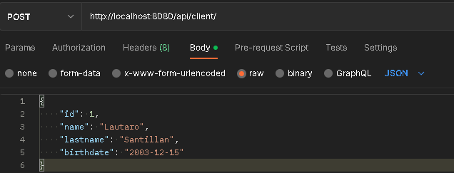
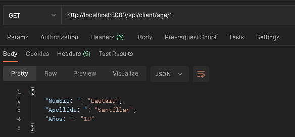

## Desafio 3: Cliente API Rest

### Consigna:

* Crear la tabla cliente con los siguientes atributos: nombre, apellido, fecha de nacimiento. Además, crear un restcontroller que retorne un json con la siguiente estructura:

  {

  nombre: XXXXXX,

  apellido: YYYYYY,

  años: #####

  }

  En la capa servicio se deberá calcular la edad de la persona consultada y retornar el JSON

### Formato: 

* Se debe entregar un archivo en formato .jar.
El formato del nombre debe ser “ClienteApiRest+Apellido.java”

### Sugerencias: 

* Se recomienda comentar el código para explicar qué hace cada parte del mismo.

### Aspectos a incluir: 

* Entregar el proyecto en formato jar que ejecute sin errores y dejar el resultado en consola

### Resultado:

